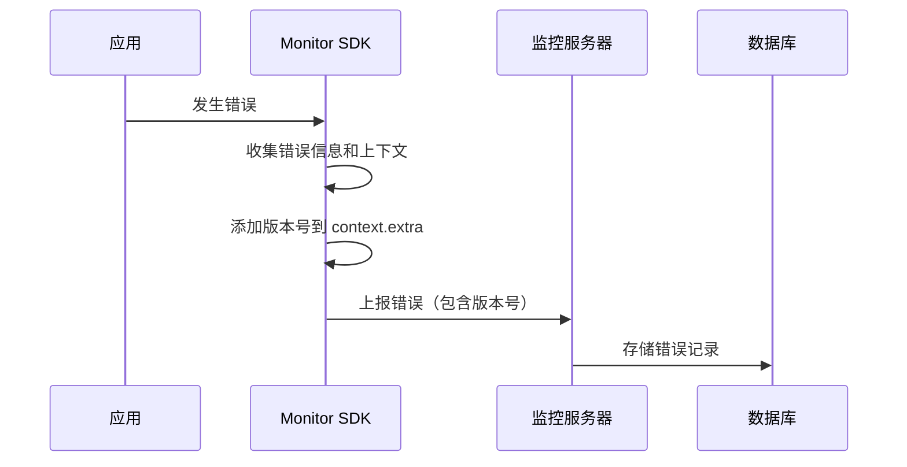
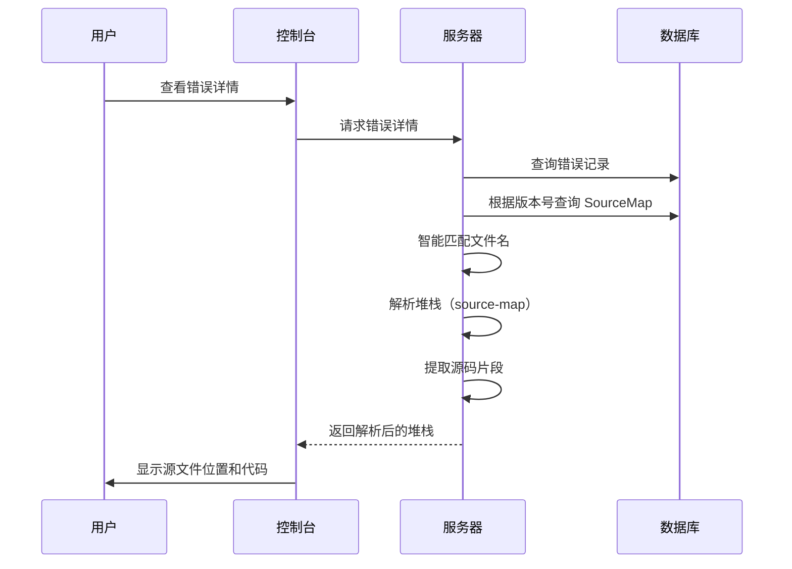

# SourceMap 功能使用指南

本文档详细介绍监控系统的 SourceMap 功能，帮助你在生产环境精确定位错误源码位置。

## 功能概览

### ✅ 已实现的功能

1. **智能文件匹配**
   - 自动识别和去除文件名中的 hash（如 `chunk-BISVECJP.js` → `chunk.js`）
   - 支持去除 URL query 参数
   - 模糊匹配算法，提高匹配成功率

2. **版本管理**
   - 根据版本号精确匹配 SourceMap
   - 自动从 package.json 读取版本号
   - 支持手动指定版本号

3. **开发环境支持**
   - 开发环境自动解析和显示源文件位置
   - 无需上传 SourceMap 即可查看源码

4. **多种上传方式**
   - CLI 命令行工具
   - Vite 插件（自动上传）
   - CI/CD 集成

5. **安全性**
   - 支持上传后自动删除本地 SourceMap
   - API Key 认证
   - 避免源码泄露

## 快速开始

### 1. 在 SDK 中配置版本号

确保在初始化 SDK 时指定版本号：

```typescript
import { initMonitor } from '@monitor/sdk-react';

initMonitor({
  apiKey: 'your-api-key',
  serverUrl: 'http://localhost:8080',
  version: '1.0.0', // 重要：指定版本号
  environment: 'production',
  enableError: true,
});
```

### 2. 构建时生成 SourceMap

确保在构建配置中开启 sourcemap：

```typescript
// vite.config.ts
export default defineConfig({
  build: {
    sourcemap: true, // 必须开启
  },
});
```

### 3. 上传 SourceMap

#### 方式一：使用 Vite 插件（推荐）

```typescript
// vite.config.ts
import { monitorSourceMapPlugin } from '@monitor/cli/vite-plugin';

export default defineConfig({
  plugins: [
    monitorSourceMapPlugin({
      apiKey: process.env.MONITOR_API_KEY!,
      serverUrl: 'http://localhost:8080',
      deleteAfterUpload: true,
      productionOnly: true,
    }),
  ],
  build: {
    sourcemap: true,
  },
});
```

#### 方式二：使用 CLI 工具

```bash
# 构建
pnpm build

# 上传
monitor-cli upload-sourcemap \
  --api-key your-api-key \
  --url http://localhost:8080 \
  --dir ./dist \
  --delete
```

## 工作原理

### 错误上报流程



### SourceMap 解析流程



### 文件匹配算法

1. **提取基础文件名**
   ```
   http://localhost:5173/assets/chunk-BISVECJP.js?v=abc123
   ↓
   chunk-BISVECJP.js
   ↓
   chunk.js
   ```

2. **去除 Hash**
   - 识别模式：`-[hash].js` 或 `.[hash].js`
   - 保留基础文件名

3. **精确匹配**
   - 首先尝试完全匹配
   - 失败后尝试模糊匹配

4. **版本优先**
   - 优先使用错误版本号对应的 SourceMap
   - 未找到时使用最新版本

## 常见场景

### 场景 1：开发环境错误

**问题**：开发环境看到的是 `chunk-BISVECJP.js:71:11`，而不是源文件

**解决方案**：
- ✅ 系统会自动识别并去除 hash
- ✅ 开发环境无需上传 SourceMap，浏览器已加载
- ✅ 服务端智能解析并显示源文件位置

### 场景 2：生产环境错误

**问题**：生产环境代码被压缩混淆，无法定位错误

**解决方案**：
```bash
# 1. 构建时生成 sourcemap
pnpm build

# 2. 上传 SourceMap（与应用版本号一致）
monitor-cli upload-sourcemap \
  --api-key your-api-key \
  --url https://monitor.example.com \
  --dir ./dist \
  --delete  # 删除本地文件，避免泄露

# 3. 在控制台查看，自动显示源码位置
```

### 场景 3：多版本管理

**问题**：同时有多个版本在线上运行

**解决方案**：
```typescript
// 每次发版时更新版本号
initMonitor({
  version: '1.2.3', // 与 package.json 保持一致
  // ...
});

// 上传对应版本的 SourceMap
monitor-cli upload-sourcemap --version 1.2.3 ...
```

系统会自动根据错误的版本号匹配对应的 SourceMap。

### 场景 4：CI/CD 自动化

**GitHub Actions 示例**：

```yaml
name: Deploy

on:
  push:
    tags:
      - 'v*'

jobs:
  deploy:
    runs-on: ubuntu-latest
    steps:
      - uses: actions/checkout@v3

      - name: Get version
        id: version
        run: echo "VERSION=${GITHUB_REF#refs/tags/v}" >> $GITHUB_OUTPUT

      - name: Build
        run: pnpm build
        env:
          VITE_APP_VERSION: ${{ steps.version.outputs.VERSION }}

      - name: Upload SourceMap
        run: |
          monitor-cli upload-sourcemap \
            --api-key ${{ secrets.MONITOR_API_KEY }} \
            --url ${{ secrets.MONITOR_URL }} \
            --version ${{ steps.version.outputs.VERSION }} \
            --dir ./dist \
            --delete

      - name: Deploy to production
        run: pnpm deploy
```

## 最佳实践

### 1. 版本号管理

```json
// package.json
{
  "version": "1.2.3",
  "scripts": {
    "build": "vite build",
    "version": "npm version patch && git push --tags"
  }
}
```

### 2. 环境变量

```bash
# .env.production
VITE_MONITOR_API_KEY=your-api-key
VITE_MONITOR_URL=https://monitor.example.com
VITE_APP_VERSION=$npm_package_version
```

```typescript
// vite.config.ts
import pkg from './package.json';

export default defineConfig({
  plugins: [
    monitorSourceMapPlugin({
      apiKey: process.env.VITE_MONITOR_API_KEY!,
      serverUrl: process.env.VITE_MONITOR_URL!,
      version: pkg.version,
      deleteAfterUpload: process.env.NODE_ENV === 'production',
      productionOnly: true,
    }),
  ],
});
```

### 3. 安全性

```typescript
// ❌ 不要这样做
export default defineConfig({
  build: {
    sourcemap: true,
  },
});
// 这会将 .map 文件一起部署到生产环境

// ✅ 推荐做法
export default defineConfig({
  plugins: [
    monitorSourceMapPlugin({
      deleteAfterUpload: true, // 上传后删除
    }),
  ],
  build: {
    sourcemap: true,
  },
});
```

### 4. 性能优化

```typescript
// 只在需要时上传 SourceMap
export default defineConfig({
  plugins: [
    monitorSourceMapPlugin({
      productionOnly: true, // 只在生产环境上传
    }),
  ],
});
```

## 故障排查

### 问题 1：错误显示的仍是压缩后的代码

**可能原因**：
1. SourceMap 未上传
2. 版本号不匹配
3. 文件名不匹配

**解决方法**：
```bash
# 1. 检查是否上传成功
monitor-cli upload-sourcemap --api-key xxx --url xxx --dir dist

# 2. 确认版本号一致
# SDK 初始化：version: '1.0.0'
# 上传时：--version 1.0.0

# 3. 查看服务器日志
# 检查匹配逻辑是否正常
```

### 问题 2：开发环境显示不正确

**可能原因**：
- Vite 开发服务器未生成 SourceMap
- 浏览器缓存

**解决方法**：
```typescript
// vite.config.ts
export default defineConfig({
  build: {
    sourcemap: true, // 确保开启
  },
});
```

清除浏览器缓存后重试。

### 问题 3：上传失败

**可能原因**：
1. API Key 无效
2. 网络问题
3. 文件权限

**解决方法**：
```bash
# 测试连接
curl -X POST http://localhost:8080/api/sourcemap/upload \
  -H "X-API-Key: your-api-key" \
  -H "Content-Type: application/json" \
  -d '{"version":"1.0.0","filePath":"test.js","mapData":"{}"}'

# 检查文件权限
ls -la dist/*.map
```

## API 参考

### CLI 参数

```bash
monitor-cli upload-sourcemap [options]

Options:
  -k, --api-key <key>        API Key（必需）
  -u, --url <url>            服务器地址（必需）
  -v, --version <version>    版本号（可选，默认从 package.json 读取）
  -d, --dir <directory>      SourceMap 文件目录（必需）
  -p, --pattern <pattern>    文件匹配模式（默认：**/*.js.map）
  --delete                   上传后删除本地文件
  --include-sources          同时上传源文件
  -h, --help                 显示帮助
```

### Vite 插件选项

```typescript
interface SourceMapUploadOptions {
  /** API Key（必需） */
  apiKey: string;
  
  /** 服务器地址（必需） */
  serverUrl: string;
  
  /** 版本号（可选，默认从 package.json 读取） */
  version?: string;
  
  /** 上传后删除本地文件（可选，默认 false） */
  deleteAfterUpload?: boolean;
  
  /** 只在生产环境上传（可选，默认 false） */
  productionOnly?: boolean;
  
  /** 文件匹配模式（可选，默认 **/*.js.map） */
  pattern?: string;
}
```

## 总结

SourceMap 功能的关键点：

1. ✅ **版本一致性**：SDK 和上传时的版本号必须一致
2. ✅ **智能匹配**：自动识别和去除文件名 hash
3. ✅ **安全第一**：生产环境删除 SourceMap，避免源码泄露
4. ✅ **自动化**：使用插件或 CI/CD 自动上传
5. ✅ **开发友好**：开发环境自动解析，无需额外配置

通过正确配置 SourceMap，你可以在生产环境快速定位错误，提高问题排查效率！
